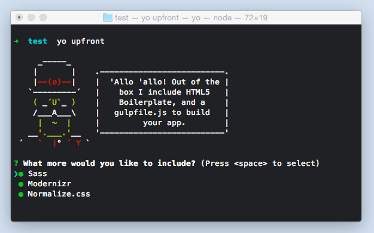

# Upfront
> A swift Front-end starter

## Technologies

* [gulp](http://gulpjs.com) - build system automating tasks
* [libsass](http://github.com/sass/libsass) - SCSS compilation (optional)
* [jshint](http://jshint.com) - code quality for JavaScript
* [browserSync](http://browsersync.io) - preview web app with live reloading
* [imagemin](https://github.com/imagemin/imagemin) - optimize images

## General Installation

The generator requires NodeJS to be installed. Please visit the [NodeJS website](https://nodejs.org/) for installation instructions.

Upon ensuring NodeJS is properly installed, simply run the following commands on your `terminal` or `command prompt`.

- `npm install -g yo bower` - install yeoman and bower
- `npm install -g generator-upfront` - install the generator

#### For Windows 7 users
NodeJS installs on `%USERPROFILE%\AppData\Roaming\npm\` so you have to set your environment varialble NODE_PATH to point to this location.

1. Click the `Start` Menu, and right-click `Computer`.
2. Click `Advanced system settings` > `Advanced` tab > `Environment Variables`.
3. Click `New` and enter the following values:
    - Varialble name: `NODE_PATH`
    - Varialble value: `%USERPROFILE%\AppData\Roaming\npm\`
4. Click `OK` to finish.

## Scaffolding your App

- `cd [PATH-TO-PROJECT]`
    - navigate to your project folder and make sure it's empty.
- `yo upfront`
    - starts the generator and gives you a selection of which modules you want to include (press <kbd>Space</kbd> to check/uncheck options).
- `gulp serve`
    - this will spawn a web server at `localhost:9000` and watch for your changes.
    - start developing!
- `gulp build`
    - this command will generate a build for your app, minifying JS and CSS as well as inject necessary components. For more info, check out the `gulpfile.js` generated.

## Contributing

Feel free to contribute to this generator by forking this repository. You can also email me [jubal.mabaquiao@gmail.com](mailto:jubal.mabaquiao@gmail.com)